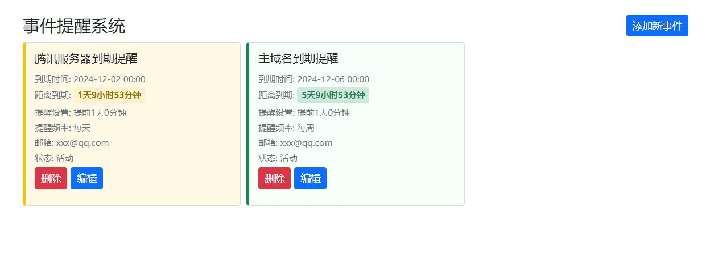

# 事件提醒工具

用户输入自己关注的各种事件，设定提醒配置，会自动根据配置时间进行邮箱通知

## 功能特点

- 事件管理
- 邮箱通知

## 安装说明

1. 确保已安装Python 3.10或更高版本
2. 安装依赖包：
   ```bash
   pip install -r requirements.txt
   ```

## 使用说明

1. 运行应用：
   ```bash
   python app.py
   ```

2. 在浏览器中访问 http://localhost:5000

3. 添加事件
4. 设定通知配置
5. 系统会按照通知配置进行邮箱通知

## 截图展示


